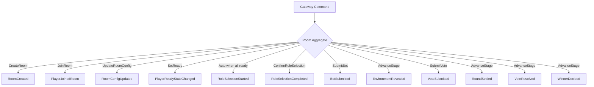
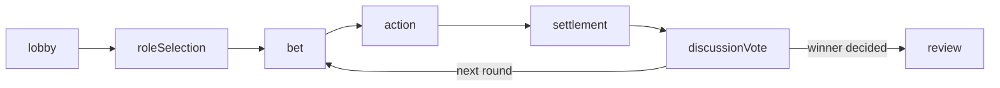
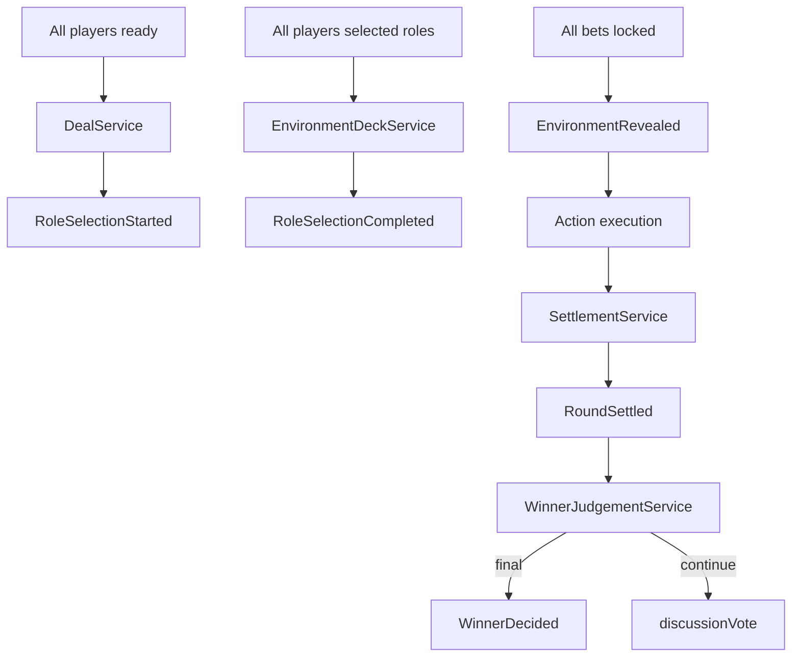

# Room Flow

This document visualizes the Room aggregate lifecycle and stage flow aligned with the latest core business process.

## Command To Event Flow

## Stage Progression

## Service Collaboration

