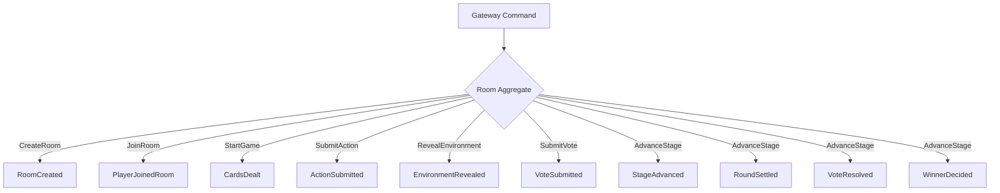
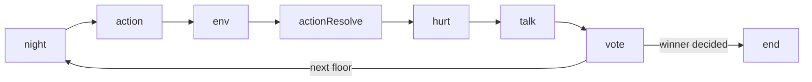
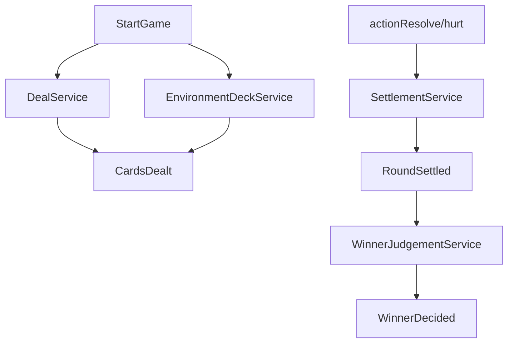

·# Room Flow

This document visualizes the Room aggregate lifecycle and stage flow.

## Command To Event Flow

```mermaid
flowchart TD
  A[Gateway Command] --> B{Room Aggregate}
  B -->|CreateRoom| C[RoomCreated]
  B -->|JoinRoom| D[PlayerJoinedRoom]
  B -->|StartGame| E[CardsDealt]
  B -->|SubmitAction| F[ActionSubmitted]
  B -->|RevealEnvironment| G[EnvironmentRevealed]
  B -->|SubmitVote| H[VoteSubmitted]
  B -->|AdvanceStage| I[StageAdvanced]
  B -->|AdvanceStage| J[RoundSettled]
  B -->|AdvanceStage| K[VoteResolved]
  B -->|AdvanceStage| L[WinnerDecided]
```

## Stage Progression

```mermaid
flowchart LR
  N[night] --> A[action]
  A --> E[env]
  E --> R[actionResolve]
  R --> H[hurt]
  H --> T[talk]
  T --> V[vote]
  V -->|next floor| N
  V -->|winner decided| X[end]
```

## Service Collaboration

```mermaid
flowchart TD
  S[StartGame] --> DS[DealService]
  S --> ES[EnvironmentDeckService]
  DS --> C[CardsDealt]
  ES --> C
  AR[actionResolve/hurt] --> SS[SettlementService]
  SS --> RS[RoundSettled]
  RS --> WS[WinnerJudgementService]
  WS --> WD[WinnerDecided]
```
