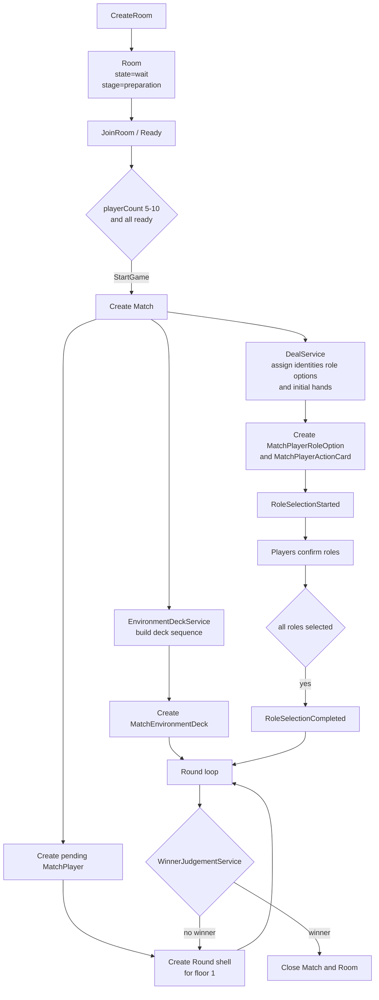
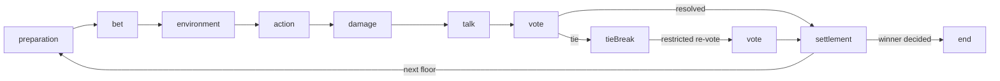
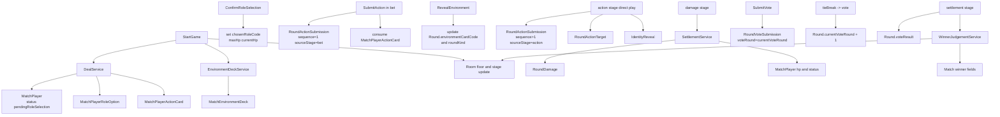

# Room Flow

This document visualizes the Room aggregate lifecycle and the updated round flow after the PostgreSQL rule model normalization.

## Room To Match Lifecycle

## Round Stage Progression

- `SubmitAction` happens in `bet`; the `action` stage only executes the locked submissions.
- `preparation` contains role confirmation; the room cannot advance to `bet` before `RoleSelectionCompleted`.
- Each floor already has a persisted Round shell before `environment`; reveal only fills `environmentCard` and `roundKind`.
- `damage` resolves environment damage and action damage before players can talk or vote.
- `tieBreak` is a constrained branch: only tied targets remain valid vote targets, and tied players cannot vote.
- `settlement` finalizes vote result, elimination, winner check, and the next-floor pointer; a second tie means no vote elimination that floor.

## Command To Persistence Flow

