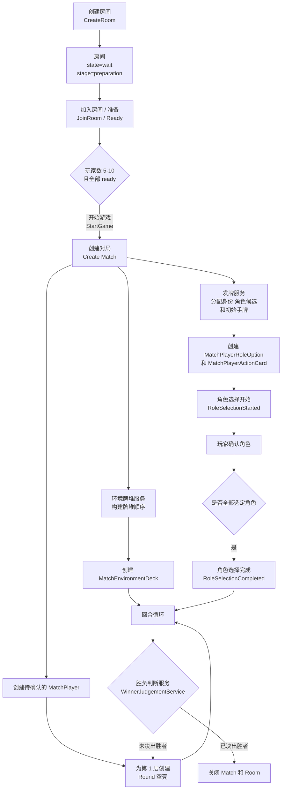
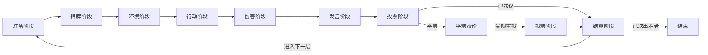
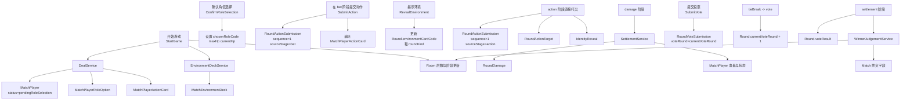

# 房间流程

本文档用于展示 Room 聚合的生命周期，以及 PostgreSQL 规则模型归一化后的最新回合流程。

## 房间到对局的生命周期

## 回合阶段推进

- `SubmitAction` 发生在 `bet`；`action` 阶段只执行已经锁定的提交。
- `preparation` 包含角色确认；在 `RoleSelectionCompleted` 之前，房间不能进入 `bet`。
- 每一层在进入 `environment` 之前就已经持久化了一个 `Round` 空壳；揭示时只补齐 `environmentCard` 和 `roundKind`。
- `damage` 会先结算环境伤害和行动伤害，然后玩家才能发言或投票。
- `tieBreak` 是一个受限分支：只有平票目标仍然是合法投票目标，且平票玩家不能投票。
- `settlement` 负责最终确认投票结果、淘汰结果、胜负检查以及下一层指针；若第二次仍平票，则该层不会发生投票淘汰。

## 命令到持久化的流转

